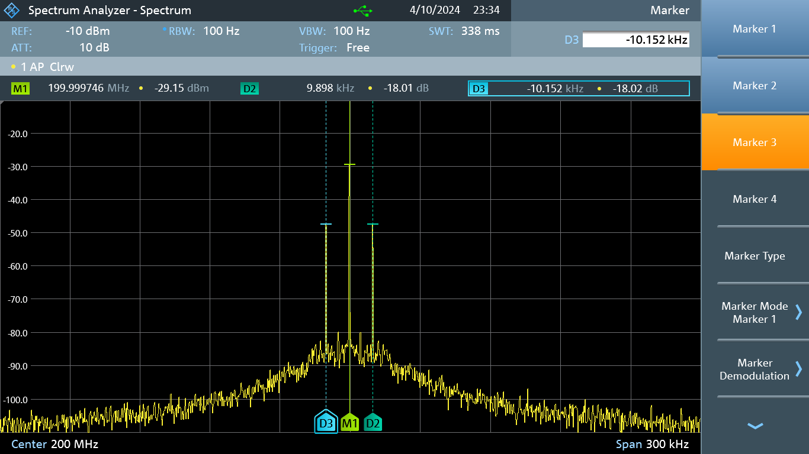
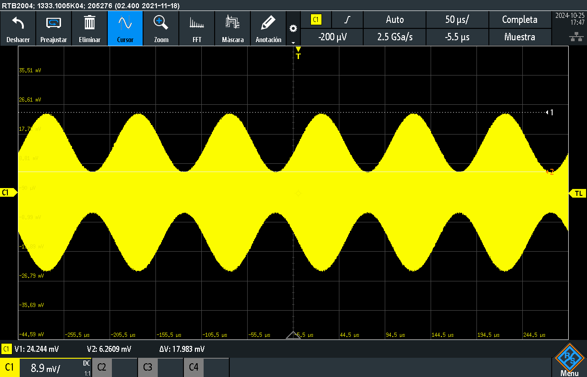
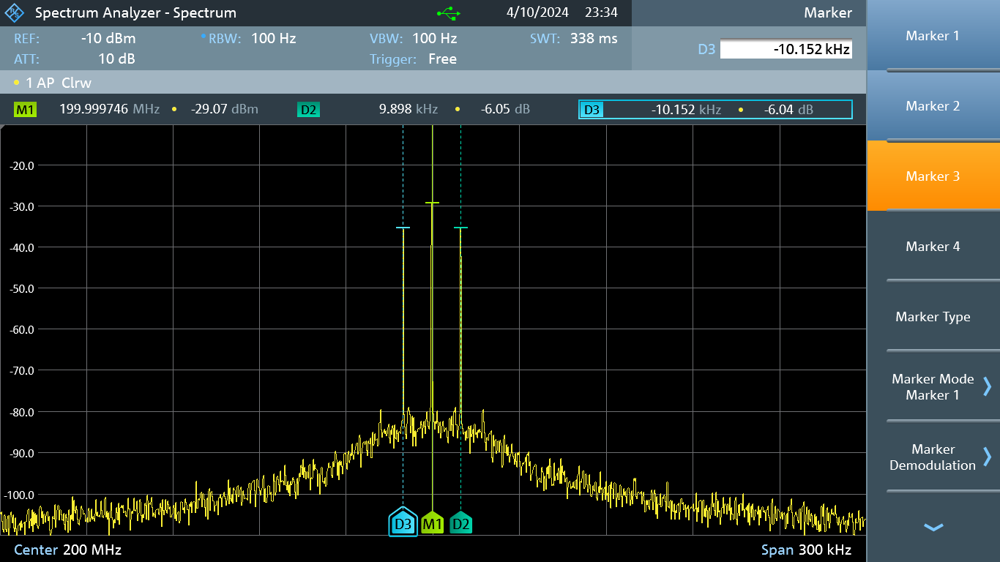
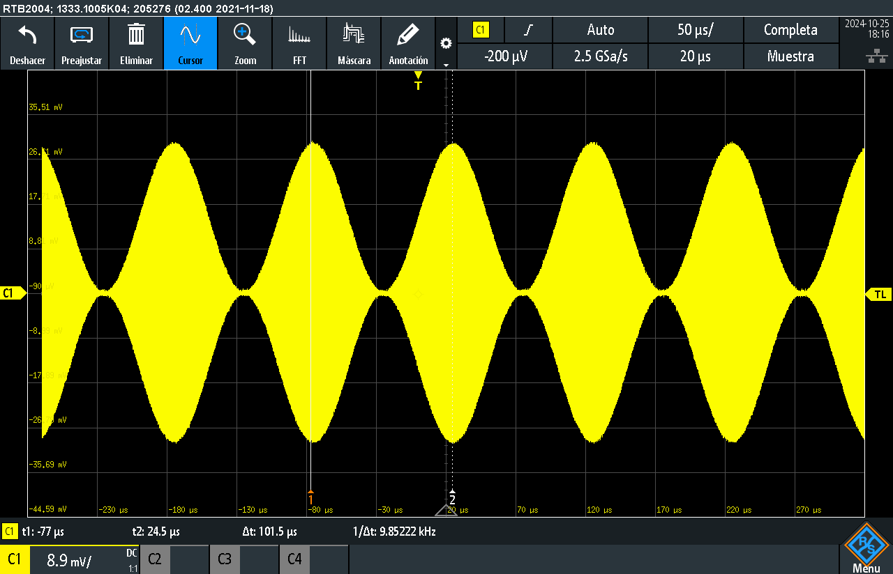

**Laboratorio 3A**

En esta practica se realizaron modulaciones lineales AM con los parametros establecidos para esta prácctica y se lograron observar sus caracteristicas  las cuales son dadas por la portadora y el factor kaAm en el cual se realizaron variaciones  de manera que se pudo observar y/o calcular la potencia de la portadora y sus bandas laterales así como el análisis de las características de estas modulaciones tanto en el osciloscopio como en el espectrometro. Y más importante saber que tipo de modulación esta experimentando la señal, es decir, si está sobre modulada, modulada y la criticamente modulada (la que se encuentra rozando el eje X).
Esta practica nos ayudo a mejorar el manejo de los aparatos de medición (osciloscopio y espectrometro), y a poder tener un entendimiento claro del comportamiento de las señales cuando se estan variando los valores de la Amplitud del mensaje y la constante Ka.

Modulación con KaAm=0.5

Modulación con KaAm=1

Modulación con KaAm=2

